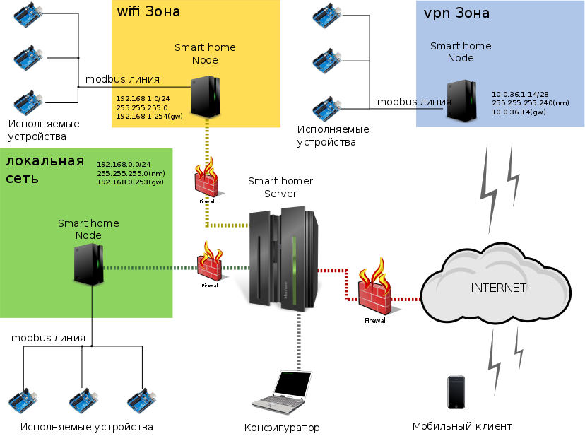

# The program complex **Smart House**

[Project site](https://e154.github.io/smart-home/) |
[Configurator](https://github.com/e154/smart-home-configurator/) |
[Node](https://github.com/e154/smart-home-node/) |
[Development Tools](https://github.com/e154/smart-home-tools/) |
[Smart home Socket](https://github.com/e154/smart-home-socket/) |
[Modbus device controller](https://github.com/e154/smart-home-modbus-ctrl-v1/)

[](https://travis-ci.org/e154/smart-home)
[](https://coveralls.io/github/e154/smart-home?branch=master)


Attention! The project is under active development.
---------

### Overview

Basic principles Underlying the system being developed, ease of configuration and content, cheapness and availability of the component base.
So you can manage a lot of devices based on AVR microcontrollers and not only.
A distributed network does not have geographic boundaries and allows you to manage devices anywhere in the Internet through
System of nodes - microservices. And you will be able to interact with these devices in the way that they are
In your local network. Create scripts, and respond to events in the web interface of the configurator through a flexible scripting system.
Manage the state of devices from any subnet where the management server is available.

- [Demo access](#demo-access)
- [Supported system](#supported-system)
- [Quick installation](#quick-installation)
    - [Server](#server)
    - [Configurator](#configurator)
    - [Node](#node)
    - [Postgresql](#database-postgresql)
- [Installation for development](#installation-for-development)
    - [Server](#main-server-install)
- [Testing](#testing)
- [Support](#support)
- [Contributors](#contributors)
- [See also](#see-also)
- [License](#license)

### Demo access

[demo dashboard](https://board.e154.ru)
[swagger](https://sh.e154.ru/api/v1/swagger)
user: admin@e154.ru
pass: admin

### Supported system
    
*   macOS 386 10.6
*   macOS amd64 10.6
*   linux 386
*   linux amd64
*   linux arm-5
*   linux arm-6
*   linux arm-7
*   linux arm-64
*   linux mips64
*   linux mips64le
*   windows 386
*   windows amd64

Schematic smart home map



### Quick installation

[Installation help](https://e154.github.io/smart-home/getting-started/#install)

#### Server

```bash
curl -sSL http://e154.github.io/smart-home/server-installer.sh | bash /dev/stdin --install
```

#### Configurator

```bash
curl -sSL http://e154.github.io/smart-home/configurator-installer.sh | bash /dev/stdin --install
```

#### Node

```bash
curl -sSL http://e154.github.io/smart-home/node-installer.sh | bash /dev/stdin --install
```

#### Database postgresql

System **Smart Home** works with **Postgresql database**. Create a database and database user with full rights to this database.
Connection parameters to the database must be specified in the configuration file. Updating the server version may require updating the database.
, migrations will start automatically, manual intervention is not required.

```bash
sudo -u postgres psql
postgres=# create database mydb;
postgres=# create user myuser with encrypted password 'mypass';
postgres=# grant all privileges on database mydb to myuser;
```

Run server

```bash
./server

 ___                _     _  _
/ __|_ __  __ _ _ _| |_  | || |___ _ __  ___
\__ \ '  \/ _' | '_|  _| | __ / _ \ '  \/ -_)
|___/_|_|_\__,_|_|  \__| |_||_\___/_|_|_\___|


2019/06/16 17:11:49 Graceful shutdown service started
2019/06/16 17:11:49 database connect dbname=mydb user=myuser password=mypass host=127.0.0.1 port=5432 sslmode=disable
2019/06/16 17:11:49 pq: permission denied to create extension "pgcrypto" handling 20181113_013141_workflow_elements.sql
2019/06/16 17:11:49 Applied 3 migrations!
2019/06/16 17:11:49 Serving server at tcp://[::]:1883
2019/06/16 17:11:49 subscribe get_image_list
2019/06/16 17:11:49 subscribe get_filter_list
2019/06/16 17:11:49 subscribe remove_image
INFO[0000] SRT.server.server.go:49.Start() > Serving server at http://[::]:3000
INFO[0000] SRT.telemetry.telemetry.go:37.Run() > Run
INFO[0000] SRT.stream.hub.go:155.Subscribe() > subscribe dashboard.get.nodes.status
INFO[0000] SRT.stream.hub.go:155.Subscribe() > subscribe t.get.flows.status
INFO[0000] SRT.stream.hub.go:155.Subscribe() > subscribe dashboard.get.telemetry
INFO[0000] SRT.stream.hub.go:155.Subscribe() > subscribe map.get.devices.states
INFO[0000] SRT.stream.hub.go:155.Subscribe() > subscribe map.get.telemetry
INFO[0000] SRT.stream.hub.go:155.Subscribe() > subscribe do.worker
INFO[0000] SRT.stream.hub.go:155.Subscribe() > subscribe do.action
```

it may happen that you need to grant superuser privileges in the permissions of the database user.

```bash
postgres=# alter user myuser with superuser;
```


```bash
bash-3.2$ ./server

 ___                _     _  _
/ __|_ __  __ _ _ _| |_  | || |___ _ __  ___
\__ \ '  \/ _' | '_|  _| | __ / _ \ '  \/ -_)
|___/_|_|_\__,_|_|  \__| |_||_\___/_|_|_\___|


2019/06/16 17:23:45 Graceful shutdown service started
2019/06/16 17:23:45 database connect dbname=mydb user=myuser password=mypass host=127.0.0.1 port=5432 sslmode=disable
2019/06/16 17:23:46 Applied 10 migrations!
2019/06/16 17:23:46 Serving server at tcp://[::]:1883
2019/06/16 17:23:46 subscribe get_image_list
2019/06/16 17:23:46 subscribe get_filter_list
2019/06/16 17:23:46 subscribe remove_image
INFO[0000] SRT.server.server.go:49.Start() > Serving server at http://[::]:3000
INFO[0000] SRT.telemetry.telemetry.go:37.Run() > Run
INFO[0000] SRT.stream.hub.go:155.Subscribe() > subscribe dashboard.get.nodes.status
INFO[0000] SRT.stream.hub.go:155.Subscribe() > subscribe t.get.flows.status
INFO[0000] SRT.stream.hub.go:155.Subscribe() > subscribe dashboard.get.telemetry
INFO[0000] SRT.stream.hub.go:155.Subscribe() > subscribe map.get.devices.states
INFO[0000] SRT.stream.hub.go:155.Subscribe() > subscribe map.get.telemetry
INFO[0000] SRT.stream.hub.go:155.Subscribe() > subscribe do.worker
INFO[0000] SRT.stream.hub.go:155.Subscribe() > subscribe do.action
```

Server can by run on the port: **3000**

Run configurator

```bash
/opt/smart-home/configurator/configurator
```

The configurator console will be available in the browser at [http://localhost:8080](http://localhost:8080) 

Run node

```bash
/opt/smart-home/node/node
```

The same commands, but without binding to the console

```bash
/opt/smart-home/server/server > /dev/null 2>&1 &
/opt/smart-home/configurator/configurator > /dev/null 2>&1 &
/opt/smart-home/node/node > /dev/null 2>&1 &
```

It's all:)

### Installation for development

#### main server install

```bash
go get -u github.com/golang/dep/cmd/dep

git clone https://github.com/e154/smart-home $GOPATH/src/github.com/e154/smart-home

cd $GOPATH/src/github.com/e154/smart-home

dep ensure

go build

./smart-home -reset
./smart-home
```

editing configuration files

```bash
cp conf/config.dev.json conf/config.json
cp conf/dbconfig.dev.yml conf/dbconfig.yml
```

manually create the database and run the command

```bash
./smart-home migrate
```

run server

```bash
./smart-home
```

for test

```bash
./examples/scripts/auth.sh
```

It's all

### Testing

The system supports self-testing of internal components, and is started by the command

```bash
go test ./tests -v
```

### Support 

Smart home Wiki: [e154.github.io/smart-home](https://e154.github.io/smart-home/)
Bugs and feature requests: GitHub issues

### Contributors

- [Alex Filippov](https://github.com/e154)

All the contributors are welcome. If you would like to be the contributor please accept some rules.
- The pull requests will be accepted only in "develop" branch
- All modifications or additions should be tested

Thank you for your understanding!

### See also

* [OpenHub](https://www.openhab.org)
* [iridiummobile](http://www.iridiummobile.net)
* [amx](https://www.amx.com/en-US)

### LICENSE

[MIT Public License](https://github.com/e154/smart-home/blob/master/LICENSE)