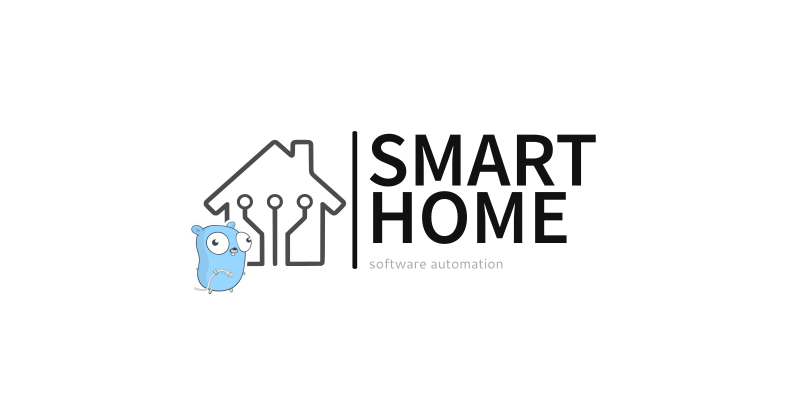

# The **Smart Home**

[Project site](https://e154.github.io/smart-home/) |
[Node](https://github.com/e154/smart-home-node/)

[](https://goreportcard.com/report/github.com/e154/smart-home)

[](https://www.gnu.org/licenses/gpl-3.0)
[](https://t.me/SmartHomGo)

|Branch      |Status   |
|------------|---------|
|master      |    |
|dev         |   |
|docs        |      |

### Overview

With the help of the software package **Smart Home** you can control many devices. Distributed network of devices based
on software package **Smart Home** has no geographical boundaries and allows manage devices anywhere in the Internet
through a system of nodes - microservices. You will be able to interact with these devices as if they were on your local
network. Create scripts and reactions to events in the web interface of the configurator through a flexible scripting
system.

The system does not require a permanent connection to the Internet, it is completely autonomous and has no dependencies
on external services.

The basic principles underlying the system being developed are ease of setup, low cost of content and accessibility of
the component base.

- [Features](#features)
- [Demo access](#demo-access)
- [Supported system](#supported-system)
- [Quick installation](#quick-installation)
    - [Postgresql](#database-postgresql)
- [Docker](#docker)
- [Support](#support)
- [Contributors](#contributors)
- [See also](#see-also)
- [License](#license)

### Features

1. The ultimate smart thing solution - server, configurator, gateway
2. Free and open source
3. Cross-platform Linux, MacOS, Windows ...
4. Convenient WEB-configurator for fine-tuning
5. Powerful visual interface editor
5. Organization of remote access without white IP FREE
6. Role system for separation of access rights
7. Plugin system
7. Programs in javaScript, coffeeScript, typeScript
8. Notification system SMS, Email, Slack, Telegram, Web push, html5
9. Embedded MQTT server/client/bridge
9. MODBUS, [ZIGBEE2MQTT](https://www.zigbee2mqtt.io/), rpc calling, etc
10. Autonomous system.
11. Telegram bots
11. Automation scenarios
11. Quick backup/recovery
12. Have Docker images to enhance system security
13. Minimum consumption of resources.
14. Optimized for embedded devices like Raspberry Pi
15. 100% local home automation
16. Create and restore full backups of your whole configuration with ease
17. Management web interface integrated into Smart home

### Demo access

dashboard:<br />
[dashboard](https://gate.e154.ru:8443) (https://gate.e154.ru:8443) <br />

server id:<br />
**cf4463fc-2f39-4271-a034-5c0c8087c56c**

user: admin@e154.ru <br />
pass: admin

user: user@e154.ru <br />
pass: user

openapi v3 spec:<br />
[swagger](https://gate.e154.ru:8443/#/etc/swagger) (https://gate.e154.ru:8443/#/etc/swagger)

### Supported system

* macOS 386 10.6
* macOS amd64 10.6
* linux 386
* linux amd64
* linux arm-5
* linux arm-6
* linux arm-7
* linux arm-64
* linux mips64
* linux mips64le
* windows 386
* windows amd64

Schematic smart home map


### Database postgresql

[Installing PostgreSQL 15](https://e154.github.io/smart-home/docs/install/postgresql/)

### Editing configuration files

```bash
cp conf/config.dev.json conf/config.json
```

### Main server install

Download the latest server version from [releases](https://github.com/e154/smart-home/releases)

show help options
```bash
./server-linux-amd64 help
```

run the server
```bash
./server-linux-amd64
```

### Docker

```bash
git clone https://github.com/e154/smart-home
cd smart-home
docker-compose up
```

It's all

### Support

Smart home Wiki: [e154.github.io/smart-home](https://e154.github.io/smart-home/)
Bugs and feature requests: GitHub issues

### Contributors

- [Alex Filippov](https://github.com/e154)

All the contributors are welcome. If you would like to be the contributor please accept some rules.

- The pull requests will be accepted only in "develop" branch
- All modifications or additions should be tested

Thank you for your understanding!

### See also

* [OpenHub](https://www.openhab.org)
* [iridiummobile](http://www.iridiummobile.net)
* [amx](https://www.amx.com/en-US)
* [Home Assistant](https://www.home-assistant.io/integrations/)
* [Majordomo](https://majordomohome.com)
* [Domoticz](https://www.domoticz.com/)

### LICENSE

[GPLv3 Public License](https://github.com/e154/smart-home/blob/master/LICENSE)
